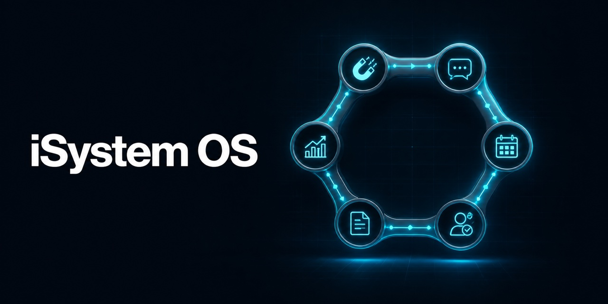

# iSystem OS

[](https://github.com/AfifiNL/isystem-os/actions/workflows/ci.yml)
[](https://github.com/AfifiNL/isystem-os/actions/workflows/security.yml)
[](LICENSE)
[](docs/features-and-maturity.md)



**iSystem OS is an Apache-2.0-licensed, self-hostable business operating system for service teams.** It is designed to connect the path from website, content, and SEO to enquiries, bookings, customer workflows, portals, agreements, invoices, and delivery evidence.

> **Published public beta (v0.1.1):** this is an installable, source-available snapshot verified from a fresh clone with the documented build, migration, security, and container contracts. Product workflows remain beta and may change. Review [feature maturity](docs/features-and-maturity.md) and the [security model](docs/security-model.md) before using real customer data.

## Why iSystem OS

Service businesses often stitch together a website, CRM, scheduler, client portal, documents, and reporting. iSystem OS aims to make that operating flow understandable and adaptable in one codebase:

`attract -> enquire -> book -> deliver -> document -> improve`

- Self-host the application while keeping control of configuration and data providers.
- Configure branding, workspaces, locales, and modules without rewriting shared code.
- Use a multi-tenant foundation with role-aware workflows.
- Extend one domain at a time through clear feature boundaries.

## Start here

The bootstrap helper is the supported first-run path. It installs locked dependencies, validates `isystem.config.ts`, and prepares `.env.local`; it does not provision Supabase, apply migrations, or configure external providers.

```bash
git clone https://github.com/AfifiNL/isystem-os.git
cd isystem-os
./setup.sh
```

Then follow [Getting started](docs/getting-started.md). For deployment, the initial target is a self-hosted application connected to managed Supabase. A fully self-hosted Supabase path is documented as experimental.

The release verification commands include strict type-checking, reusable-branding, bootstrap, public quality, configuration, AI-contract, navigation, release-critical application, and secret-scan contracts documented in [AGENTS.md](AGENTS.md). They verify the exported SHA-256 source manifest and exported-script relative import closure, and never treat a packaging-only tree as a passing application.

The focused bootstrap and media portability checks are available independently:

```bash
npm run test:bootstrap
npm run test:branding
npm run test:ffmpeg
npm run test:release-contracts
```

Before publishing, install the exact Gitleaks, TruffleHog, Trivy, and Supabase CLI versions declared in `scripts/public-tool-versions.sh`, then run the complete local release contract. It uses only synthetic build configuration, replays a disposable local database, starts the final image read-only, waits for its health check, and scans that image:

```bash
bash scripts/public-release-gate.sh
```

## Documentation

- [Getting started](docs/getting-started.md)
- [Architecture](docs/architecture.md)
- [Configuration](docs/configuration.md)
- [Features and maturity](docs/features-and-maturity.md)
- [Deployment options](docs/deployment/README.md)
- [Security model](docs/security-model.md)
- [Contributing](CONTRIBUTING.md)

## Project status and expectations

iSystem OS v0.1.1 is a published public beta. The source snapshot and automated release contracts are verified, but there is no promise of compatibility, uptime, regulatory compliance, or fitness for a particular purpose. Pin versions, test upgrades, keep backups, and perform your own security review.

## Using with Codex

[AGENTS.md](AGENTS.md) gives Codex the project boundaries, verification gates, and documentation map. Product commands must be revalidated whenever the public source snapshot changes.

## Community and license

Questions and ideas belong in [GitHub Discussions](https://github.com/AfifiNL/isystem-os/discussions); reproducible bugs belong in [GitHub Issues](https://github.com/AfifiNL/isystem-os/issues). Please read [SUPPORT.md](SUPPORT.md), [GOVERNANCE.md](GOVERNANCE.md), and [CODE_OF_CONDUCT.md](CODE_OF_CONDUCT.md).

Original project code is licensed under [Apache-2.0](LICENSE). Dependencies and assets remain under their own terms; notably, the required GSAP animation packages use the separate GSAP Standard License rather than an OSI-approved license. Review [THIRD_PARTY_NOTICES.md](THIRD_PARTY_NOTICES.md) before redistribution. The code license does not grant rights to the iSystem or iSystem.ai names or marks; see [TRADEMARKS.md](TRADEMARKS.md) and [NOTICE](NOTICE).

Public brand site: https://isystem.ai
